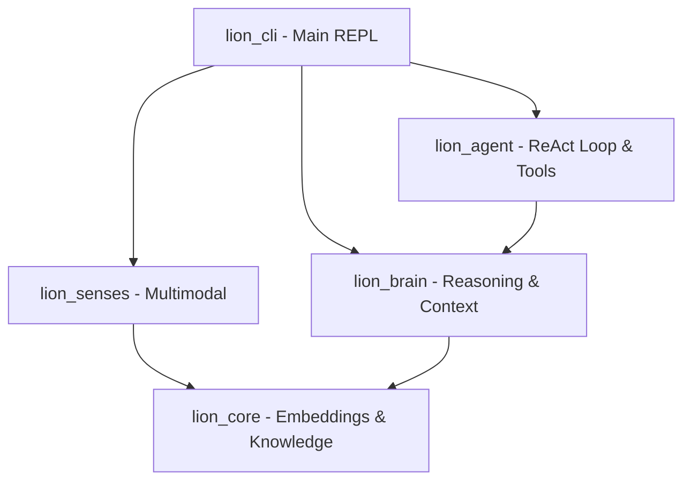

# 🦁 LionLLM / LionAI v1.0

A fully modular, production-ready cognitive AI assistant built natively in Rust. LionLLM wraps local large language models (via Ollama) with a biology-inspired cognitive graph, a persistent semantic memory store, multimodal perception channels (vision and audio), a 7-stage reasoning pipeline, and an autonomous ReAct-based agent loop with local tool access.

---

## 🏗 System Architecture

The project is structured as five specialized crates:



1. **`lion_core`**: Low-level sensory cortex containing the 1.58-bit Ternary Encoder, persistent Knowledge Graph, and Long-Term Memory.
2. **`lion_brain`**: Cognitive engine driving the 7-stage Thinking+ pipeline (Understand $\to$ Remember $\to$ Retrieve $\to$ Reason $\to$ Generate $\to$ Verify $\to$ Optimize), Ollama client, and token context manager.
3. **`lion_senses`**: Multimodal perception wrappers supporting 8x8 pixel downsampling, Sobel edge calculation, and WAV audio analysis.
4. **`lion_agent`**: Autonomous ReAct loop with local tools (calculator, file read/write, safe shell runner, and text-only web fetcher).
5. **`lion_cli`**: Main interactive terminal REPL with streaming response capabilities and custom slash commands.

---

## 🚀 Getting Started

### 1. Compile the Project
Build the workspace in release mode:
```bash
cargo build --release
```
The compiled binary will be located at `target/release/lion`.

### 2. Run the Interactive Console
Run the unified CLI console directly:
```bash
cargo run --release -p lion_cli
```

### 3. Run the Integrated Tests
Verify all sixteen phases of implementation:
```bash
cargo test -p lion_cli
```

---

## ⚡ Slash Commands

Inside the REPL console, you can run commands directly using slash prefixes:

| Command | Arguments | Description |
| :--- | :--- | :--- |
| `/help` | None | Displays help guidelines. |
| `/status` | None | Displays system, memory, and Ollama connectivity status. |
| `/memory` | None | Shows total persistent memory entries loaded. |
| `/clear` | None | Flushes the current conversation history. |
| `/tools` | None | Lists all tools available to the ReAct agent. |
| `/use` | `<tool> <input>` | Direct tool execution bypassing the LLM. |
| `/calc` | `<expression>` | Computes math expressions instantly using native Rust. |
| `/image` | `<path>` | Encoders an image into a 32-dim vector and generates an LLM description. |
| `/audio` | `<path.wav>` | Analyzes key features (RMS, frequency bands, ZCR) of a WAV file. |
| `/agent` | `<task>` | Launches the autonomous ReAct tool loop to complete a complex task. |
| `/save` | None | Forces memory serialization to disk. |
| `/exit` | None | Exits the program (automatically saving memory to `~/.lionai/memory.bin`). |

---

## 🔬 Local LLM Setup (Optional)
To unlock full generative text responses and visual descriptions:
1. Download and run [Ollama](https://ollama.com).
2. Pull the default language model:
   ```bash
   ollama pull gemma3:1b
   ```
3. (Optional) Pull the vision model:
   ```bash
   ollama pull moondream
   ```
If Ollama is offline, LionLLM degrades gracefully into local memory-driven fallback mode and direct tool execution.
