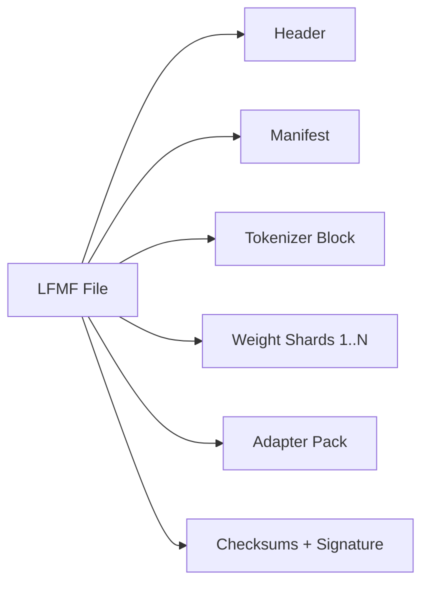

# Memory & Storage — ENFS + LFMF

## Overview

ENFS ("Einstein Neurons File System") is an AI-native filesystem design for organizing model weights, memory tiers, and domain-specific knowledge. LFMF ("Lion Flexible Model Format") is a binary container format for model files and tensor sharding.

## ENFS: Memory Hierarchy

```
Input → Sensory Memory → Working Memory → Reasoning Layer → Memory Manager → Long-Term Memory (by domain)
```

- **Sensory Memory**: Camera frames, audio buffers, keyboard/text inputs. Extremely short-lived; CPU/GPU cache or RAM.
- **Working Memory**: Active conversation context, current task state, in-flight embeddings. Resides in RAM, managed per session/turn.
- **Domain Memory** (Long-Term): Domain-partitioned storage — language, science, mathematics, physics, skills, 2D/3D perception, safety policies.
- **Archive Memory**: Historical checkpoints, cold embeddings, backups. Highly compressed, persistent storage.

Promotion/demotion: Frequently accessed entries move upward toward working memory; inactive entries migrate to archive storage.

## ENFS: Root Filesystem Layout

```
/
├── manifest/       — volume identity, format version, mount options
├── metadata/       — global volume metadata (owner, version, checksums)
├── memory/         — working/long-term/episodic/semantic memory structures
├── domains/        — language, math, physics, science, skills, safety, 2D, 3D
├── tensors/        — model weights, embeddings, activations
├── indexes/        — path/tensor/semantic lookup structures
├── checkpoints/    — training checkpoints, session snapshots
├── cache/          — preloaded chunks, hot embeddings
├── security/       — keys, signatures, permissions
├── plugins/        — compression/indexing/accelerator plugins
├── adapters/       — LoRA packs, task/domain adapters
├── models/         — base model + submodel definitions
├── assets/         — non-tensor support data
├── archive/        — cold storage, deprecated versions
├── logs/           — mount/update/access logs
└── system/         — internal runtime state
```

## LFMF: Model Container Format Specification

Designed for multi-dtype tensor packing, sharding, streamed loading, and adapter integration.

### File Specifications
- Extension: `.lfmf`
- MIME type: `application/x-lfmf`
- Magic Number: `LFMF` (`0x4C 0x46 0x4D 0x46`)
- Versioning: Semantic versioning (`major.minor.patch`)
- Alignment: Configurable 64B – 16KB byte alignment

### Container Layout

```
+-----------------------------------------------------------------------+
|  Header  |  Manifest  |  Tokenizer Block  |  Shards  |  Adapters  | Sig |
+-----------------------------------------------------------------------+
```



## Comparison with Existing Standards

- **Safetensors**: Zero-copy `mmap` loading, JSON header with byte offsets, strict security (no code execution). LFMF adds native adapter packing and domain metadata.
- **GGUF**: Single-file portability and quantization variety (Q4_K, Q8_0). LFMF extends sharding for multi-file models.
