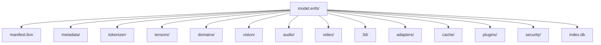

# ENFS v1.0 — Einstein Neurons Filesystem

**Full name:** Einstein Neurons File System
**Short name:** ENFS
**Status:** Design Specification
**Role:** Development-time model filesystem (directory-based)
**Distribution counterpart:** LFMF (`.lfmf` packed file)

> **Design status note:** Core memory tiers (`MemoryTier`, `TieredMemoryManager`)
> are implemented in `lion_core/src/lfmf.rs`. The full filesystem layout below is
> an architectural blueprint — not a mounted kernel filesystem.

---

## 1. Core Concept

ENFS is an AI-native directory structure that organises model weights, cognitive memory
tiers, and domain-specific knowledge as a navigable filesystem rather than an opaque binary blob.

**Advantages over a single file:**

- Load only the required layers — skip unneeded shards entirely
- Replace one layer without rewriting the entire model
- Download or update only changed files (diff-friendly)
- Easier version control (git-compatible directory structure)
- Supports multiple models sharing common components
- Simpler debugging: inspect any tensor as a plain binary file
- Natural fit for distributed/object-store backends

---

## 2. Cognitive Memory Architecture

ENFS maps directly onto how biological and AI cognitive systems organise memory:

```
Input
  ↓
Sensory Memory      ← CPU/GPU cache, nanosecond retention
  ↓
Working Memory      ← RAM, per-session, sub-millisecond access
  ↓
Reasoning Layer     ← Active inference context
  ↓
Memory Manager      ← Promotion / demotion engine
  ↓
Long-Term Memory    ← NVMe SSD, domain-partitioned
  ↓
Archive Memory      ← Cold storage, compressed
```

### Memory Tiers (implemented in `lion_core::lfmf::MemoryTier`)

| Tier | Storage | Access latency | Contents |
|---|---|---|---|
| Sensory | CPU/GPU cache | ~1 ns | Camera frames, audio buffers, raw inputs |
| Working | RAM | ~100 ns | Active context, in-flight embeddings, current task state |
| Domain | NVMe SSD | ~100 µs | Language, science, math, physics, skills, 2D, 3D, safety |
| Archive | Compressed SSD / cold storage | ~10 ms | Historical checkpoints, cold embeddings, deprecated versions |

**Promotion policy:** Records accessed ≥ `promotion_threshold` times move toward Working memory.
**Demotion policy:** Records not accessed within `archive_tick_threshold` ticks demote to Archive.

---

## 3. Domain Memory Partitions

Long-term memory is split into independently addressable domain stores:

| Domain | Path | Contents |
|---|---|---|
| Language | `domains/language/` | Multilingual embeddings, grammar rules, tokenizer knowledge |
| Mathematics | `domains/mathematics/` | Symbolic math, proofs, equations, theorem database |
| Physics | `domains/physics/` | Laws, constants, simulation primitives |
| Science | `domains/science/` | Biology, chemistry, astronomy, general science |
| Skills | `domains/skills/` | Procedural knowledge, task graphs |
| 2D Perception | `domains/2d/` | Images, video frames, spectrograms, waveforms |
| 3D Perception | `domains/3d/` | Meshes, point clouds, depth maps, scene graphs |
| Safety | `domains/safety/` | Ethical constraints, policy rules, harm classifiers |
| Intelligence | `domains/intelligence/` | Meta-cognitive patterns, reasoning strategies |

---

## 4. Root Filesystem Layout

```
model.enfs/
│
├── manifest.lion           ← Volume identity, format version, mount options
├── config.lion             ← Runtime configuration
│
├── metadata/               ← Global volume metadata
│   ├── author
│   ├── license
│   ├── version
│   └── benchmarks/
│
├── tokenizer/              ← Tokenizer data
│   ├── vocab.bin
│   ├── merges.bin
│   └── config.lion
│
├── tensors/                ← Model weight shards
│   ├── layer_0000/
│   │   ├── q_proj.bin
│   │   ├── k_proj.bin
│   │   ├── v_proj.bin
│   │   ├── o_proj.bin
│   │   └── mlp.bin
│   ├── layer_0001/
│   └── ...
│
├── domains/                ← Domain-partitioned long-term memory
│   ├── language/
│   ├── mathematics/
│   ├── physics/
│   ├── science/
│   ├── skills/
│   ├── 2d/
│   ├── 3d/
│   ├── safety/
│   └── intelligence/
│
├── vision/                 ← Vision encoder weights
├── audio/                  ← Audio encoder weights
├── video/                  ← Video encoder weights
│
├── adapters/               ← LoRA / QLoRA / DoRA adapter packs
│   ├── lora_v1/
│   └── qlora_instruct/
│
├── plugins/                ← Custom quantization, compression, accelerator plugins
│
├── cache/                  ← Preloaded chunks, hot embeddings (ephemeral)
├── checkpoints/            ← Training checkpoints
├── snapshots/              ← Point-in-time session snapshots
│
├── security/               ← Keys, signatures, access control
│   ├── public.key
│   ├── manifest.sig
│   └── permissions.lion
│
├── logs/                   ← Mount, update, and access logs
│
├── system/                 ← Internal runtime state (loader, scheduler)
│
└── index.db                ← Fast lookup index (tensor name → file offset)
```

---

## 5. Internal Architecture



---

## 6. Hybrid Packaging Model

```
Development         Distribution        Deployment
-----------         ------------        ----------
model.enfs/  →pack→  model.lfmf  →load→  Inference Engine
             ←unpack←
```

| Format | Use case | Structure |
|---|---|---|
| `model.enfs/` | Development, editing, version control, inspection | Directory tree |
| `model.lfmf` | Distribution, production serving | Single packed binary |

This mirrors source code (directory) → release archive (binary).

---

## 7. Performance Design

| Technique | Mechanism |
|---|---|
| Memory-mapped I/O | `mmap` / `MapViewOfFile` — zero kernel-copy reads |
| `index.db` | O(1) tensor lookup by name without scanning the tree |
| Lazy shard loading | Only layers needed for current inference loaded |
| Layer prefetch | Prediction-based prefetch of next N layers |
| SIMD-aligned tensors | Tensors aligned to 64-byte cache line boundaries |
| Zero-copy deserialization | `rkyv`-compatible binary layout [PLANNED] |
| Domain isolation | Independent domain stores — no lock contention across domains |

> **Honest estimate:** Zero-copy mmap + O(1) index access gives sub-millisecond shard
> loading for NVMe-backed stores. Actual throughput depends on tensor sizes, NVMe queue
> depth, and whether pages are already in the OS page cache. These are engineering
> estimates, not measured benchmarks of this system.

---

## 8. Security

| Feature | Mechanism |
|---|---|
| Per-file BLAKE3 hash | Stored in `index.db` and verified on load |
| Whole-volume hash | Hash of all chunk hashes, stored in `manifest.lion` |
| Ed25519 signature | `security/manifest.sig` signs the manifest hash |
| Encrypted tensors | AES-256-GCM per sensitive shard [PLANNED] |
| Access control | Per-domain permission policy in `security/permissions.lion` |

---

## 9. ENFS v1.0 Document Index

Full specification spans 73 documents:

```
ENFS_v1.0/
├── 00_INDEX.md
├── 01_VISION_AND_PURPOSE.md
├── 02_COGNITIVE_MEMORY_ARCHITECTURE.md
├── 03_MEMORY_HIERARCHY.md
├── 04_ENFS_ARCHITECTURE.md
├── 05_ROOT_FILESYSTEM_LAYOUT.md
├── 06_DIRECTORY_STRUCTURE.md
├── 07_FILE_AND_FOLDER_NAMING.md
├── 08_VOLUME_FORMAT.md
├── 09_BLOCKS_AND_CHUNKS.md
├── 10_TENSOR_STORAGE_ENGINE.md
├── 11_NEURON_OBJECTS.md
├── 12_MEMORY_ENGINES.md
├── 13_INDEXING_ENGINE.md
├── 14_METADATA_SYSTEM.md
├── 15_RUNTIME_LOADER.md
├── 16_CACHE_SYSTEM.md
├── 17_STREAMING_ENGINE.md
├── 18_COMPRESSION_ENGINE.md
├── 19_ENCRYPTION_AND_SECURITY.md
├── 20_VERSIONING_AND_UPDATES.md
├── 21_PLUGIN_ARCHITECTURE.md
├── 22_ADAPTER_SYSTEM.md
├── 23_MULTIMODAL_STORAGE.md
├── 24_2D_MEMORY_SYSTEM.md
├── 25_3D_MEMORY_SYSTEM.md
├── 26_AUDIO_MEMORY_SYSTEM.md
├── 27_VIDEO_MEMORY_SYSTEM.md
├── 28_LANGUAGE_MEMORY.md
├── 29_KNOWLEDGE_MEMORY.md
├── 30_SCIENCE_MEMORY.md
├── 31_MATHEMATICS_MEMORY.md
├── 32_PHYSICS_MEMORY.md
├── 33_SKILL_MEMORY.md
├── 34_INTELLIGENCE_ENGINE.md
├── 35_REASONING_ENGINE.md
├── 36_PLANNING_ENGINE.md
├── 37_DECISION_ENGINE.md
├── 38_LEARNING_ENGINE.md
├── 39_EPISODIC_MEMORY.md
├── 40_SEMANTIC_MEMORY.md
├── 41_WORKING_MEMORY.md
├── 42_SENSORY_MEMORY.md
├── 43_LONG_TERM_MEMORY.md
├── 44_NEURAL_GRAPH.md
├── 45_DEPENDENCY_GRAPH.md
├── 46_INFERENCE_PIPELINE.md
├── 47_MODEL_LOADING.md
├── 48_PARALLEL_EXECUTION.md
├── 49_GPU_NPU_ACCELERATION.md
├── 50_SIMD_OPTIMIZATION.md
├── 51_ZERO_COPY_MEMORY.md
├── 52_ASYNC_RUNTIME.md
├── 53_DISTRIBUTED_STORAGE.md
├── 54_CLUSTER_SUPPORT.md
├── 55_NETWORK_PROTOCOL.md
├── 56_DATASET_STORAGE.md
├── 57_CHECKPOINT_SYSTEM.md
├── 58_SNAPSHOT_SYSTEM.md
├── 59_DELTA_UPDATES.md
├── 60_BACKUP_AND_RECOVERY.md
├── 61_INTEGRITY_VERIFICATION.md
├── 62_ERROR_HANDLING.md
├── 63_LOGGING_SYSTEM.md
├── 64_CONFIGURATION.md
├── 65_API_SPECIFICATION.md
├── 66_FILE_FORMAT_REFERENCE.md
├── 67_PERFORMANCE_GUIDE.md
├── 68_HARDWARE_REQUIREMENTS.md
├── 69_BENCHMARKS.md
├── 70_FUTURE_ROADMAP.md
├── 71_GLOSSARY.md
└── 72_APPENDIX.md
```

---

## 10. Roadmap

| Version | Focus |
|---|---|
| v1.0 | Core directory layout, memory tiers, tensor index, tokenizer, domain stores, BLAKE3 integrity |
| v2.0 | Distributed tensor storage, remote streaming, encrypted domains, cluster support |
| v3.0 | Federated model packages, live delta updates, cross-model component sharing, NPU-native shard format |

---

## 11. Scope Note

ENFS defines *how model data is organized and accessed*. It does not define:
- How a model reasons or what it knows (that comes from training data and architecture)
- Runtime correctness guarantees (those are Footprint's responsibility via contracts and the ledger)
- What "100% correct answers" means — no storage format can guarantee factual correctness;
  that is a model capability and alignment question, separate from the filesystem

ENFS + LFMF handle the **storage and loading layer** reliably and efficiently.
What the model does with the loaded weights is a separate concern.
