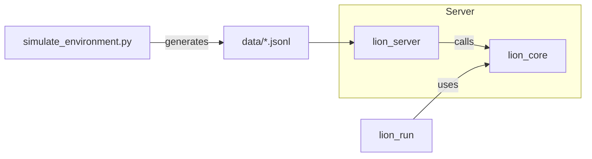
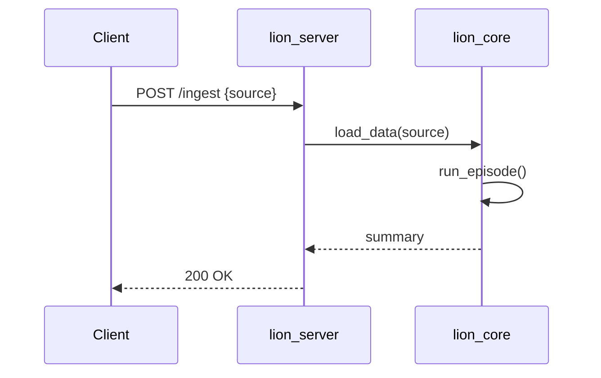

# Architecture Diagrams

Below are high-level architecture diagrams (Mermaid) to help visualize component interactions.

System overview

Sequence: ingestion -> episode

These diagrams are intentionally small; expand them with additional nodes for storage, proxies, and monitoring when planning a deployment.
